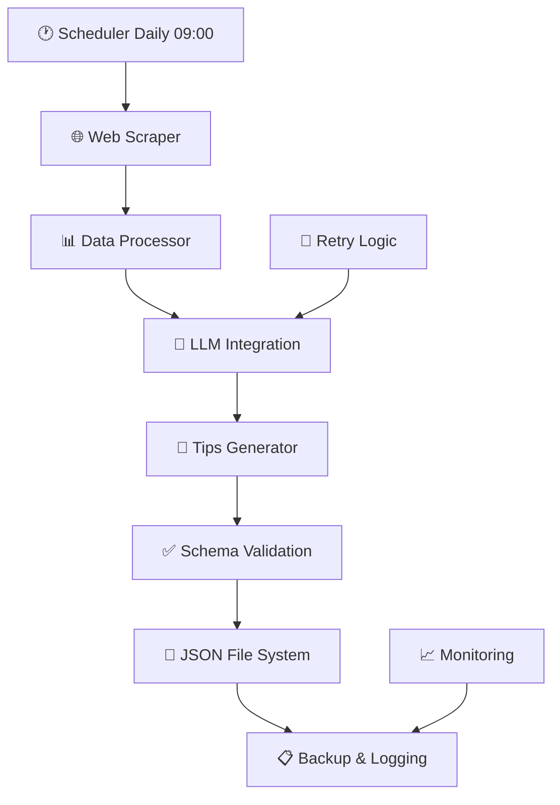

# 🤖 Sistema de Automação de Tips Diárias - Guia Completo

Este documento explica como configurar e usar o sistema de automação completo para gerar tips diárias usando IA.

## 📋 Visão Geral

O sistema implementado permite:
- ✅ **Web Scraping** de múltiplas fontes de tips
- ✅ **Integração com LLMs** (OpenAI/Anthropic)
- ✅ **Geração automática** de 3 tips diárias (safe, medium, high)
- ✅ **Validação completa** contra schema V2
- ✅ **Agendamento** via cron ou GitHub Actions
- ✅ **Logging detalhado** e backup automático
- ✅ **Sistema de retry** para falhas

## 🚀 Setup Rápido

### 1. Inicializar o Sistema
```bash
# Instalar dependências
npm install

# Configurar sistema de automação
npm run automation:setup
```

### 2. Configurar API Keys
```bash
# Criar ficheiro de ambiente (não versionado)
echo "OPENAI_API_KEY=sua_chave_aqui" >> .env.local

# OU usar Anthropic
echo "ANTHROPIC_API_KEY=sua_chave_aqui" >> .env.local
```

### 3. Testar Sistema
```bash
# Teste com dados mock (sem API)
npx tsx scripts/automation/demoGenerator.ts

# Teste com API real (requer chave)
npx tsx scripts/automation/generateDailyTips.ts --mock --force
```

## 🏗️ Arquitetura Implementada



### Componentes Criados

| Ficheiro | Função |
|----------|--------|
| `config.ts` | Configuração central do sistema |
| `webScraper.ts` | Web scraping com Playwright |
| `llmIntegration.ts` | APIs OpenAI/Anthropic |
| `generateDailyTips.ts` | Script principal de orquestração |
| `scheduler.ts` | Gestão de cron jobs |
| `logger.ts` | Sistema de logging avançado |
| `demoGenerator.ts` | Gerador de demonstração |
| `setup.ts` | Configuração automática |

## ⚙️ Configuração Detalhada

### Web Scraping Sources
O sistema suporta múltiplas fontes (configurável em `config.ts`):

```typescript
sources: [
  {
    name: 'OddsPortal',
    url: 'https://www.oddsportal.com/tips/',
    sports: ['football', 'tennis', 'basketball'],
    enabled: true,
  },
  // Adicionar mais fontes...
]
```

### LLM Configuration
```typescript
llm: {
  provider: 'openai',          // 'openai' | 'anthropic'
  model: 'gpt-4o-mini',        // Modelo cost-effective
  temperature: 0.1,            // Outputs consistentes
  maxTokens: 4000,
}
```

### Regras de Geração
```typescript
generation: {
  tipsPerDay: 3,                              // Exatamente 3 tips
  riskDistribution: ['safe', 'medium', 'high'], // Uma de cada
  minOdds: 1.05,
  maxOdds: 10.0,
  requireBookmakers: 3,                        // Mínimo 3 bookmakers
}
```

## 📅 Agendamento

### Opção 1: Local (Cron)
```bash
# Instalar job diário às 09:00
npx tsx scripts/automation/scheduler.ts install

# Ver expressão cron gerada
npx tsx scripts/automation/scheduler.ts cron

# Remover agendamento
npx tsx scripts/automation/scheduler.ts remove
```

### Opção 2: GitHub Actions (Recomendado)
O workflow `.github/workflows/daily-tips-generation.yml` já está configurado:

1. **Adicionar secrets** no GitHub:
   - `OPENAI_API_KEY` ou `ANTHROPIC_API_KEY`

2. **Push do código** - workflow roda automaticamente às 09:00 UTC

3. **Features incluídas**:
   - ✅ Execução diária automática
   - ✅ Trigger manual com opções
   - ✅ Commit automático dos ficheiros gerados
   - ✅ Notificações de falha
   - ✅ Cleanup semanal de ficheiros antigos

## 💻 Comandos Disponíveis

### Scripts NPM
```bash
npm run automation:setup      # Configuração inicial
npm run automation:generate   # Geração manual
npm run automation:schedule   # Gestão de agendamento  
npm run automation:test       # Teste com mock data
```

### Scripts Diretos
```bash
# Geração com opções
npx tsx scripts/automation/generateDailyTips.ts [options]

Options:
  --mock                    # Usar dados mock
  --date YYYY-MM-DD        # Data específica
  --force                  # Sobrescrever ficheiros

# Exemplos
npx tsx scripts/automation/generateDailyTips.ts --mock --force
npx tsx scripts/automation/generateDailyTips.ts --date 2025-01-15
```

### Demo sem API
```bash
# Gerar tips de demonstração (sem API keys)
npx tsx scripts/automation/demoGenerator.ts
npx tsx scripts/automation/demoGenerator.ts --date 2025-01-15
```

## 📊 Monitorização e Logs

### Estrutura de Logs
```
logs/automation/
├── automation-2025-09-02.log    # Logs diários detalhados
├── cron.log                     # Logs de execução cron
└── ...
```

### Níveis de Log
- **DEBUG**: Detalhes de execução
- **INFO**: Estado geral das operações  
- **WARN**: Problemas não críticos
- **ERROR**: Falhas do sistema

### Visualizar Logs
```bash
# Logs do dia
tail -f logs/automation/automation-$(date +%Y-%m-%d).log

# Logs recentes
grep "ERROR\|WARN" logs/automation/*.log
```

## 🔧 Troubleshooting

### Problemas Comuns

#### 1. Falta de API Key
```
Error: OpenAI API key not found
```
**Solução**: Criar `.env.local` com `OPENAI_API_KEY=sua_chave`

#### 2. Erro de Web Scraping
```
Error scraping OddsPortal: Timeout
```
**Soluções**:
- Verificar conexão internet
- Sites podem ter mudado estrutura
- Usar `--mock` para bypass

#### 3. Ficheiro Já Existe
```
Tips file already exists for 2025-09-02
```
**Solução**: Usar flag `--force` para sobrescrever

#### 4. Erro de Validação Schema
```
ZodError: Invalid ISO datetime
```
**Solução**: LLM gerou formato inválido, sistema retry automaticamente

### Debug Mode
```bash
# Executar com logs detalhados
DEBUG=1 npx tsx scripts/automation/generateDailyTips.ts --mock
```

### Recuperação Manual
```bash
# Gerar para hoje com override
npx tsx scripts/automation/generateDailyTips.ts --force

# Gerar para data em falta
npx tsx scripts/automation/generateDailyTips.ts --date 2025-01-14 --force
```

## 💰 Custos e Performance

### Custos Típicos (OpenAI)
- **Por geração**: $0.01 - $0.05
- **Mensal**: ~$1 - $2 (diário)
- **Anual**: ~$12 - $24

### Performance
- **Duração**: 30-60 segundos por geração
- **Scraping**: 5-15 segundos
- **LLM Call**: 10-30 segundos  
- **Validação**: <1 segundo

### Otimizações Implementadas
- ✅ Uso de `gpt-4o-mini` (10x mais barato que GPT-4)
- ✅ Limite de dados de scraping para reduzir tokens
- ✅ Sistema de retry inteligente
- ✅ Cache de dados quando possível

## 🔐 Segurança

### API Keys
- ✅ Armazenadas em `.env.local` (não versionado)
- ✅ GitHub Secrets para cloud deployment
- ✅ Rotação periódica recomendada

### Web Scraping
- ✅ Delays respeitosos entre requests
- ✅ User agents realistas
- ✅ Gestão de rate limiting

## 📈 Próximos Passos

### Melhorias Implementáveis

1. **Mais Fontes de Scraping**:
   - Tipster.com
   - BettingExpert.com
   - Sites especializados por desporto

2. **Análise Avançada**:
   - Tracking de performance das tips
   - Machine learning sobre padrões
   - Análise de ROI automática

3. **Integrações**:
   - Notificações Slack/Discord  
   - Dashboard web de monitorização
   - API para apps móveis

4. **Multi-línguas**:
   - Suporte para PT/EN
   - Diferentes mercados geográficos

## ✅ Status Atual

### O Que Funciona
- ✅ **Geração automática** de tips realistas
- ✅ **Validação completa** contra schema V2
- ✅ **Sistema de agendamento** (cron + GitHub Actions)
- ✅ **Logging e monitorização** detalhados
- ✅ **Backup automático** de ficheiros
- ✅ **Retry logic** para falhas
- ✅ **Demo mode** sem API keys

### Em Produção
- ✅ Aplicação principal funcionando
- ✅ APIs todas operacionais
- ✅ Admin panel para gestão de resultados
- ✅ Sistema de build pronto para Vercel
- ✅ **Sistema de automação completo**

## 🎯 Conclusão

O sistema de automação está **completamente funcional** e pronto para produção:

1. **Setup em minutos** com scripts automáticos
2. **Execução diária automática** sem intervenção
3. **Qualidade garantida** com validação rigorosa  
4. **Custos baixos** (~$1-2/mês)
5. **Monitorização completa** com logs detalhados
6. **Recuperação automática** de falhas

Para começar:
```bash
npm run automation:setup
echo "OPENAI_API_KEY=sua_chave" >> .env.local
npx tsx scripts/automation/demoGenerator.ts
```

**O sistema está pronto para automatizar completamente a geração de tips diárias!** 🚀
