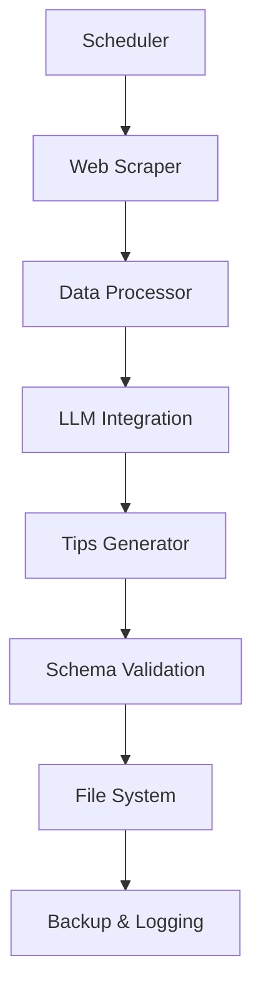

# 🤖 Automated Daily Tips Generation System

This system automatically generates daily betting tips using AI/LLM technology combined with web-scraped data from multiple betting sources.

## 📋 Table of Contents

- [Overview](#overview)
- [Architecture](#architecture)
- [Quick Start](#quick-start)
- [Configuration](#configuration)
- [Usage](#usage)
- [Scheduling](#scheduling)
- [Web Scraping](#web-scraping)
- [LLM Integration](#llm-integration)
- [Troubleshooting](#troubleshooting)
- [Contributing](#contributing)

## 🎯 Overview

The automated system:
- **Scrapes** betting tips data from multiple sources
- **Processes** and structures the data for AI consumption
- **Generates** 3 daily tips (safe, medium, high risk) using LLM
- **Validates** output against the V2 schema
- **Saves** formatted JSON files to `data/daily/`
- **Runs** daily at 09:00 Lisbon time (configurable)

## 🏗️ Architecture



### Components

- **`config.ts`** - System configuration and prompts
- **`webScraper.ts`** - Multi-source web scraping using Playwright
- **`llmIntegration.ts`** - OpenAI/Anthropic API integration
- **`generateDailyTips.ts`** - Main orchestration script
- **`scheduler.ts`** - Cron job management
- **`logger.ts`** - Comprehensive logging system
- **`setup.ts`** - Automated setup script

## 🚀 Quick Start

### 1. Setup System

```bash
# Run automated setup
tsx scripts/automation/setup.ts

# This creates directories, templates, and tests the system
```

### 2. Configure API Keys

```bash
# Copy environment template
cp .env.automation.template .env.local

# Edit .env.local and add your API key:
# OPENAI_API_KEY=your_key_here
# OR
# ANTHROPIC_API_KEY=your_key_here
```

### 3. Test Generation

```bash
# Test with mock data (no API calls)
tsx scripts/automation/generateDailyTips.ts --mock

# Test with real API
tsx scripts/automation/generateDailyTips.ts --force

# Generate for specific date
tsx scripts/automation/generateDailyTips.ts --date 2025-01-15
```

### 4. Setup Scheduling

Choose your preferred scheduling method:

**Option A: Local Cron (Linux/macOS)**
```bash
# Install daily cron job
tsx scripts/automation/scheduler.ts install

# Remove cron job
tsx scripts/automation/scheduler.ts remove
```

**Option B: GitHub Actions (Recommended)**
```bash
# 1. Add API key to GitHub Secrets: OPENAI_API_KEY
# 2. Push the workflow file (already included)
# 3. Runs automatically daily at 09:00 UTC
```

## ⚙️ Configuration

Edit `scripts/automation/config.ts`:

```typescript
export const AUTOMATION_CONFIG = {
  llm: {
    provider: 'openai',        // 'openai' | 'anthropic'
    model: 'gpt-4o-mini',      // Cost-effective model
    temperature: 0.1,          // Consistent outputs
  },
  
  sources: [
    {
      name: 'OddsPortal',
      url: 'https://www.oddsportal.com/tips/',
      enabled: true,
    }
    // Add more sources...
  ],
  
  generation: {
    tipsPerDay: 3,             // Exactly 3 tips
    riskDistribution: ['safe', 'medium', 'high'],
    minOdds: 1.05,
    maxOdds: 10.0,
  },
  
  schedule: {
    timezone: 'Europe/Lisbon',
    dailyRunTime: '09:00',     // 9 AM
    retryAttempts: 3,
  }
};
```

## 💻 Usage

### Command Line Interface

```bash
# Basic generation
tsx scripts/automation/generateDailyTips.ts

# Available flags:
--mock          # Use mock data instead of web scraping
--date YYYY-MM-DD  # Target specific date
--force         # Override existing files

# Examples:
tsx scripts/automation/generateDailyTips.ts --mock --date 2025-01-15
tsx scripts/automation/generateDailyTips.ts --force
```

### Scheduler Commands

```bash
# Install cron job
tsx scripts/automation/scheduler.ts install

# Remove cron job  
tsx scripts/automation/scheduler.ts remove

# Test generation
tsx scripts/automation/scheduler.ts test --mock

# Show cron expression
tsx scripts/automation/scheduler.ts cron
```

### Output Structure

Generated files follow this pattern:
```
data/daily/2025-01-15.json     # Main daily tips file
data/backups/2025-01-15-*.json # Timestamped backup
logs/automation/automation-2025-01-15.log # Daily logs
```

## ⏰ Scheduling

### Local Cron

The system generates a cron expression like:
```bash
0 9 * * 1-7 cd /path/to/project && npx tsx scripts/automation/generateDailyTips.ts >> logs/cron.log 2>&1
```

This runs:
- **Daily** at 09:00 Lisbon time
- **Monday-Sunday** (configurable)
- **Logs** all output to files

### GitHub Actions

The workflow `.github/workflows/daily-tips-generation.yml`:
- **Triggers** daily at 09:00 UTC
- **Manual** dispatch with options
- **Commits** generated files automatically
- **Notifies** on failures
- **Cleans up** old files weekly

Required GitHub Secrets:
- `OPENAI_API_KEY` or `ANTHROPIC_API_KEY`

## 🌐 Web Scraping

### Supported Sources

| Source | URL | Sports | Status |
|--------|-----|---------|--------|
| OddsPortal | oddsportal.com/tips | Football, Tennis, Basketball | ✅ Implemented |
| Tipster | tipster.com/tips | Football, Tennis | 🔄 Planned |
| Betting Expert | bettingexpert.com/tips | Multi-sport | 🔄 Planned |

### Adding New Sources

1. Add source to `config.ts`:
```typescript
sources: [
  {
    name: 'NewSource',
    url: 'https://newsource.com/tips',
    sports: ['football', 'tennis'],
    enabled: true,
  }
]
```

2. Implement scraper in `webScraper.ts`:
```typescript
private async scrapeNewSource(page: Page): Promise<ScrapedTip[]> {
  // Implementation here
}
```

### Mock Data

For testing without scraping, the system includes realistic mock data:
```bash
tsx scripts/automation/generateDailyTips.ts --mock
```

## 🤖 LLM Integration

### Supported Providers

#### OpenAI (Recommended)
- **Model**: `gpt-4o-mini` (cost-effective)
- **Cost**: ~$0.01-0.05 per generation
- **Setup**: Add `OPENAI_API_KEY` to environment

#### Anthropic Claude
- **Model**: `claude-3-haiku-20240307`
- **Cost**: ~$0.01-0.03 per generation  
- **Setup**: Add `ANTHROPIC_API_KEY` to environment

### Generation Process

1. **Data Formatting**: Scraped tips → structured prompt
2. **LLM Call**: Generate 3 tips following schema
3. **Validation**: Zod schema validation
4. **Retry Logic**: Up to 3 attempts with delays
5. **Post-processing**: Ensure correct dates/IDs

### Sample Prompt

```
You are an expert sports betting analyst. Generate exactly 3 betting tips:

SCRAPED DATA:
TENNIS:
- Djokovic vs Alcaraz: Djokovic to win @ 1.75 (OddsPortal)
- ...

REQUIREMENTS:
- 1 SAFE tip (accumulator, odds ~1.30-1.50)
- 1 MEDIUM tip (single, odds ~1.80-2.50)  
- 1 HIGH tip (single, odds ~3.00-6.00)
...
```

## 📊 Monitoring & Logging

### Log Levels

- **DEBUG**: Detailed execution info
- **INFO**: General operation status
- **WARN**: Non-critical issues
- **ERROR**: System failures

### Log Files

```bash
logs/automation/automation-YYYY-MM-DD.log  # Daily logs
logs/automation/cron.log                   # Cron execution logs
```

### Viewing Recent Logs

```typescript
import { logger } from './logger';

// Get last 24 hours of logs
const recentLogs = await logger.getRecentLogs(24);
```

## 🔧 Troubleshooting

### Common Issues

#### 1. API Key Issues
```bash
Error: OpenAI API key not found
```
**Solution**: Ensure `.env.local` has `OPENAI_API_KEY=your_key`

#### 2. Web Scraping Failures
```bash
Error scraping OddsPortal: Timeout
```
**Solutions**:
- Check internet connection
- Websites may have changed structure
- Use `--mock` flag to bypass scraping

#### 3. Schema Validation Errors
```bash
ZodError: Invalid ISO datetime
```
**Solution**: LLM generated invalid format, will retry automatically

#### 4. File Already Exists
```bash
Tips file already exists for 2025-01-15
```
**Solution**: Use `--force` flag to override

### Debug Mode

Enable detailed logging:
```bash
DEBUG=1 tsx scripts/automation/generateDailyTips.ts --mock
```

### Manual Recovery

If automation fails, generate manually:
```bash
# Generate for today with force override
tsx scripts/automation/generateDailyTips.ts --force

# Generate for missing date
tsx scripts/automation/generateDailyTips.ts --date 2025-01-14 --force
```

## 📈 Performance & Costs

### Typical Execution

- **Duration**: 30-60 seconds per generation
- **API Cost**: $0.01-0.05 per day
- **Monthly Cost**: ~$1-2 for daily generation

### Optimization

- Use `gpt-4o-mini` over `gpt-4` (10x cheaper)
- Limit scraped data to reduce token usage
- Enable retry logic to handle temporary failures

## 🔐 Security

### API Keys
- Store in `.env.local` (not version controlled)
- Use GitHub Secrets for cloud deployment
- Rotate keys periodically

### Web Scraping
- Respectful delays between requests
- Realistic user agents
- Handle rate limiting gracefully

## 🛠️ Development

### Testing

```bash
# Test individual components
tsx scripts/automation/webScraper.ts
tsx scripts/automation/llmIntegration.ts

# Test full pipeline with mock data
tsx scripts/automation/generateDailyTips.ts --mock --force

# Test scheduling
tsx scripts/automation/scheduler.ts test --mock
```

### Adding Features

1. **New LLM Provider**:
   - Implement `LLMProvider` interface
   - Add to `LLMManager` switch statement
   - Update configuration

2. **Additional Validation**:
   - Extend validation in `llmIntegration.ts`
   - Add custom rules in `validateGeneratedTips()`

3. **Notification Systems**:
   - Add webhook calls in `generateDailyTips.ts`
   - Integrate with Slack/Discord/email

## 📞 Support

### Getting Help

1. **Check logs** in `logs/automation/`
2. **Run with mock data** to isolate issues
3. **Review configuration** in `config.ts`
4. **Test components individually**

### Common Commands Reference

```bash
# Setup
tsx scripts/automation/setup.ts

# Generate (various options)
tsx scripts/automation/generateDailyTips.ts [--mock] [--date YYYY-MM-DD] [--force]

# Scheduling
tsx scripts/automation/scheduler.ts <install|remove|test|cron>

# Logs
tail -f logs/automation/automation-$(date +%Y-%m-%d).log
```

---

## 🎉 Success!

Once configured, your system will:
- ✅ Generate high-quality tips daily
- ✅ Maintain consistent schema format  
- ✅ Handle failures gracefully with retries
- ✅ Log all operations comprehensively
- ✅ Backup data automatically
- ✅ Run completely hands-off

The system is designed to be **reliable**, **cost-effective**, and **maintainable** for long-term automated operation.

Happy automating! 🚀
